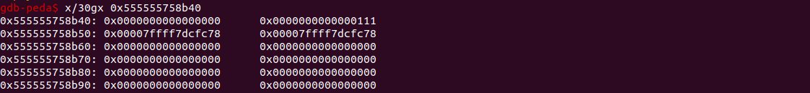
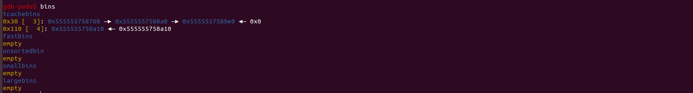

### 前言

这是我第一次写writeup,主要用来记录学习过程，练习写作能力，最重要的是方便以后自己回顾

### 环境搭建

由于本题用的是libc-2.23.so这个共享库文件，所以需要先使用patchelf修改可执行文件的库文件路径和相应ld文件的路径。

各个版本的glibc文件版本下载可以使用仓库  https://github.com/matrix1001/glibc-all-in-one 

本题patchelf 使用方式 ：patchelf --set-interpreter /home/zq/glibc-all-in-one/libs/2.23-0ubuntu11.3_amd64/ld-2.23.so --set-rpath /home/zq/glibc-all-in-one/libs/2.23-0ubuntu11.3_amd64 ./gundam 

### 解题过程

#### 整体思路

通过IDA逆向分析整理gundam文件，可以发现gundam结构体中name指针所指向的堆空间在destroy后并没有将指针设为NULL，这里可以造成double free漏洞。且程序中factory最多可以有gundam9个元素,这里就可以释放前8个gundam来使得第八个gundam(factory[7])被放入unsortedbin中（第九个元素应该是专门用来防止unsortedbin中的chunk被合并到top chunk中），再次被分配后可以拿到unsortedbin的地址，从而根据偏移量计算出libc的基址。此版本的glibc中没有堆tcachebin中进行double free检查，利用类似于fastbin dup的二次释放漏洞，将同一个chunk连续释放两次，第一次申请chunk后，修改fd指针到_free_hook的地址，之后再申请内存，也就是拿到第一个chunk，将"/bin/sh\x00"写入chunk作为参数，再次申请chunk,并将 _free_hook 函数修改为system函数的地址,最后进行destroy，也就是free函数触发原本的 _free_hook 函数，但执行了system('/bin/sh')函数，拿到shell

#### IDA分析

在创建函数中，判断的是v1<8 且 factory[v1]为真，但释放name指针后并没有将factory[v1]设置为假，造成了double free


这里可以看出最大能申请9个gundam,且根据这个chunk的大小，刚好有一个free chunk 可以挂到unsortedbin中，只要控制好输入name的字符数不超过7个，就可以拿到bk中unsortedbin的地址。


分析后得到的是一个结构体

```c
struct gundam{
	uint32_t flag;
	char *name;
	char type[24];
}gundam;
struct gundam *factory[9]
```

build过程主要是，创建gundam 设置flag为1，并给name分配空间0x100

destory过程主要是释放name的空间，冰设置flag为0，但不释放的判断条件却是 v1 > 8 || !factory[v1]，没有判断flag,造成double free


#### GDB调试分析

先创建9个gundam,再destory 8个，这里可以看到第八个gundam的name指针所指向的 free chunk被挂到了unsortedbin中地址为 0x555555758b40


从上图也可以看出来这个chunk的fd和bk都指向main_arena+88 即unsortedbin的地址



之后我们blow up这个factory,也就是将factory的前八个空间都是放掉了，留下第九个防止unsortedbin中的chunk和top chunk合并


可以看出最后一个chunk隔开了前面8个gundam的内存块，如果合并下一个再拿到chunk，fd和bk都被清零了（合并到top chunk的内存块会被清零）


再次创建8个gundam后，之前所有的free chunk被再次分配


通过 visit gundam 打印出全部的gundam ,可以看到第第八个chunk 对应gundam[7]的name值除了输入的BBBBBBB，还有一些字符，这就是bk指针的值


通过查看内存情况也是可以看出来的值为 0x00007ffff7dcfc78 查看main_arena,确认是unsortedbin的地址


拿到unsortedbin的地址后，就可以根据对应其自libc中的偏移量算出libc基址，也可以得到其他的函数地址，这里使用到了pwntools框架，我还不太熟悉

leak =  u64(io.recvuntil("Type[7]", drop=True)[-6:].ljust(8, b'\x00'))

libc_base = leak - 0x3dac78     #unsortedbin距离libc基址固定的偏移量0x3dac78     

 _free_hook_addr = libc_base + libc.symbols['__free_hook']  

 system_addr = libc_base + libc.symbols['system']


当我们两次释放(destory) factory[0]后，tcachebin中的chunk的下一个chunk是它自己


blow up (blow up 才能真正销毁一个gundam，它主要设置了gundam的第一个元素flag为0，之后才能创建新的gundam),之后开始构造函数地址



(1) build(p64(__free_hook_addr))    # 0

(2) build('/bin/sh\x00')            # 1

(3) build(p64(system_addr))         # 2

由于还不知道在调试中如何将16进制地址作为字符串来正常输入，这里只能使用代码在exp中输入，主要来分析一下函数构造的过程

由上图可知，tcachebin中本来应该有4个chunk，但由于factory[0]释放了两次，导致最后一个free的factory[0]的指向了自己，最后实际只有一个chunk,第一次build,拿到chunk后修改fd指针为p64(__free_hook_addr），这时候tcachebin 0x1100 中的情况是 0x555555758a10 - > &__free_hook_addr ,再次build后，又拿到第一次build的chunk,修改内容为 '/bin/sh\x00' ,最后再次build后就拿到了 &free_hook_addr 地址出的chunk,修改内容为 p64(system_addr)，就是把free_hook_addr 函数的地址修改为了system_addr函数的地址。此时再次free,就会将原本free后应该执行的free_hook_addr 函数换成了system_addr，并传递了参数’/bin/sh‘, (这里需要free掉'/bin/sh' 所在的chunk)

最终是拿到shell


### 总结

这种题是在低版本下，修改 _free_hook 函数是常用的拿shell的手法，找到存放函数地址的地址，修改此地址的内容为system的地址，最后free触发，这里前提工作是要泄露堆地址，使用偏移量拿到 libc基址，计算出其他的地址。最重要的是能够修改地址中的内容。整个的利用过程比较简单。等后面遇到了其他的方法再做更全面的总结。

