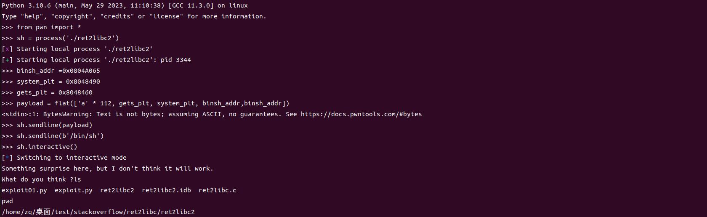
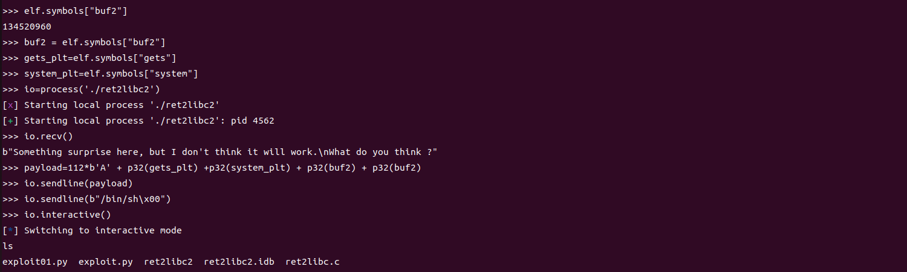
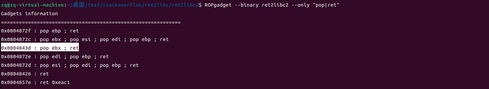

### 题目分析

这个题目和之前的ret2lib1几乎是一样的，但是少了一个条件，就是本题中没有给出字符串常量 '/bin/sh' 。第一感觉就是需要自己写入程序的数据段，最先想到的是栈段，但由于ARSL的开启,且程序中也几乎不可能提供栈段的地址。所以先向 .data段或者.bss段写入 '/bin/sh'，再调用system函数，还是根据栈函数的参数调用规则，我们可以构造一个精简的payload,填充顺序是，任意字符串填充到函数的ebp处，返回值处填入 gets@plt 的地址 0x8048460，再填入system@plt 的地址 0x8048490，后面再填入两个相同的选定的写入'/bin/sh'的地址，这样可以达到连续执行的目的，结果如下。

也可以用pwntools中的函数来获取相应的地址

对于exp的构造还有一种更通用的方法，就是在gets_plt的后面直接使用程序的一个gadget来pop一个栈空间，将第一个函数的buf2参数出栈，后面再调用system函数，这样可以连续调用两个及以上的函数，第一种exp相当于两次连续调用下的简化版，如果需要连续调用三个，第一种方法就不满足函数调用对栈的要求。

