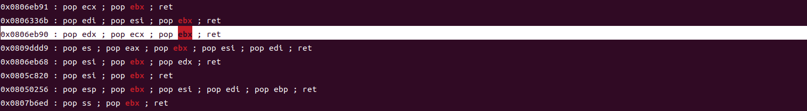

### 题目分析

使用 pwn checksec rop 查看程序的安全防护，没有canary,方便栈溢出，No PIE 容易寻找gadgets构造静态的ROP链。

```
Arch:     i386-32-little
RELRO:    Partial RELRO
Stack:    No canary found
NX:       NX enabled
PIE:      No PIE (0x8048000)
```

打开IDA分析，首先查看是否有后门函数，在函数列表中Ctrl + f 搜索system,exec等函数名。之后shift + F12,查看是否有关键字符串，像 "/bin/sh" 等。在字符串中找到了 "/bin/sh" 且栈不可执行，也没有相应的后门函数，比较容易想到构造ROP链。ROP链的初级构造简单明了，就是不仅仅要覆盖返回值，还要继续往上覆盖栈内存，返回值后面覆盖的内容主要包括两部分，参数的值和需要设置的寄存器相应指令的地址，根据栈的规则，指令地址在低地址，参数在高地址，依次构造，首先向eax中填入系统调用号，再填入各个寄存中中传递的参数，最后填入int 0x80的指令地址进行跳转执行。

通过ROPgadget来寻找合适的代码地址如下，我们可以找到一个 pop eax ; ret 的指令地址是 0x080bb196。依次类推寻找其他的指令地址，通过IDA直接可以得到字符串 "/bin/sh " 的地址。


根据32位计算机函数传参的规定，eax用作了系统调用号，后面的参数依次由 edx, ecx, ebx, esi, edi来传参，为了简化操作，我们可以再寻找到的gadgets中选择一个组合指令的地址，这里我们选择地址 0x0806eb90。



最后寻找int 0x80 指令的地址。


之后，通过gdb调试来查看溢出的字节数，IDA上面显示的对ebp和esp和变量的距离有的时候是不准确的，调试可以准确的确定溢出的字节数，108再加上上一个函数的ebp的值所占的字节数，就是返回值的位置，之后按照调用规则依次往上溢出。


最后的效果，并将其写成exp。


总结，这是一个简单的使用ROP的例子，简单在于本题并没有开启PIE可以拿到固定的指令地址进行构造。如果开启了PIE，需要使用其他技术和工具来获取依赖关系和内存布局等信息，以在运行时动态地搜索并构造ROP链。例如，可以使用泄漏漏洞来获取程序的基地址，然后基于该基地址计算偏移量来搜索和构建ROP链。
