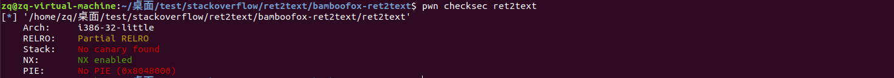
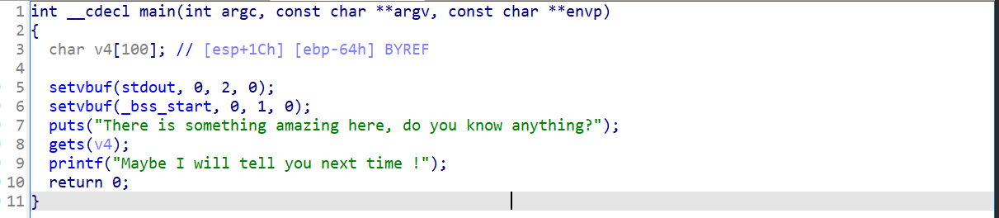
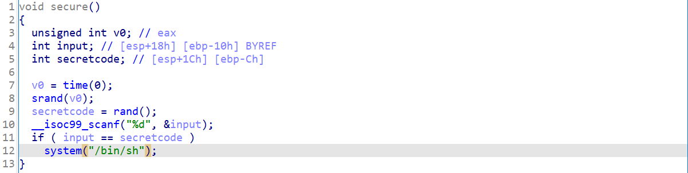
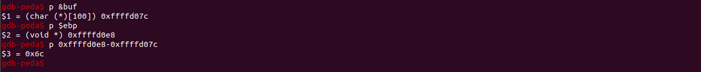
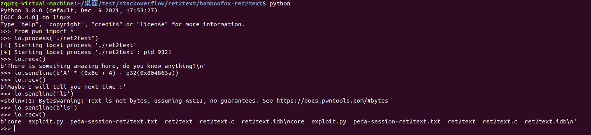
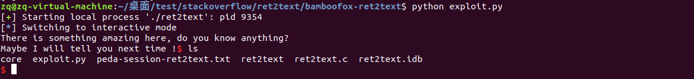

### 前言

通过对栈漏洞案例的解析，学习使用pwntools工具加快攻击速度，提高效率，也可以在巩固和深入对栈的理解。

### 环境搭建

通过svn下载ctf-wiki上的部分题目   https://github.com/ctf-wiki/ctf-challenges/tree/master/pwn/stackoverflow ,svn可以下载一个仓库的部分文件，减少不必要的磁盘消耗，使用方法如下：

```
apt install subversion 
```

然后cd到文件夹中，开启服务器

```
svnserve -d -r [file]
```

这里的file是这是的svn服务器位置，可以在任意地方新建一个文件夹，例如：

```
svnserve -d -r /home/lity/Documents/zed-adv7511/design
```

最后，将网址中的“/tree/master/”换成 “/trunk/”

```
svn checkout https://github.com/analogdevicesinc/no-OS/trunk/adv7511/zed
```

如果不是master分支，则换为“/branches/{branchname}”就可以，如“/brances/develop"

### 题目分析



这是一个最简单的栈溢出题目 ret2text ,没有开启canary,也没有开启PIE,直接通过不安全函数gets(),使得读入的字符串直接覆盖掉函数的返回值到system函数，使得main函数返回时就会执行system('/bin/sh'),拿到shell。

### IDA分析

ida直接反汇编结果就可以看到main函数中有个不安全函数gets()



通过shift + F12 可以查看程序中使用的字符串，可以看到'/bin/sh' 这个字符串，通过交叉引用可以看到另一段函数secure(),这里有system("/bin/sh"),返回值的覆盖就要用这个地址(0x0804863A)进行覆盖从而运行该函数。



### 调试

使用gdb调试,直接找到buf数组的起始地址到返回地址之间的距离，直接进行覆盖。



寄存器ebp的指向的值是上一个调用者的ebp值，所以距离是 0x6c + 4,覆盖的关键语句是 io.sendline(b'A' * (0x6c + 4) + p32(0x804863a))，输入后函数返回并执行0x804863a处的代码即

```
.text:0804863A                 mov     dword ptr [esp], offset command ; "/bin/sh"
.text:08048641                 call    _system
```



将上面的交互python语句写成文件，即expoit.py ,最终效果



### 总结

这是一个最简单的栈溢出的案例，只需要计算溢出点到返回值之间的距离直接覆盖即可，但还有开启canary的题目，如子进程爆破canary的效验值，精准覆盖。最开始看这个题的时候对偏移值的大小比较疑惑，因为其中有两句汇编 and     esp, 0FFFFFFF0     ；   add     esp, 0FFFFFF80h 想当然的以为栈中全是buf的空间，后面s单步调试后发现里面还有其他值这个从反汇编的c语言伪代码中看不出来，忘记了这些值是用来保存寄存器中的值，后面直接通过buf的初始地址，和%ebp之间的差值来计算是比较准确的，如果加了canary,其效验值也在这个offset中，后面通过题目进行更多的总结熟悉更多的pwntools的使用方法。
